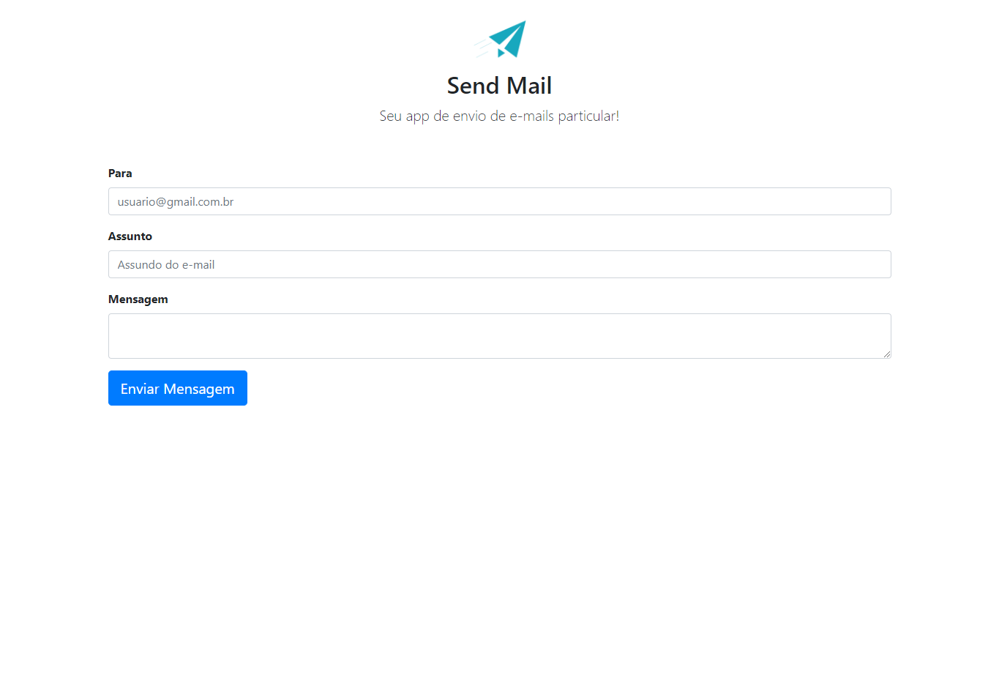
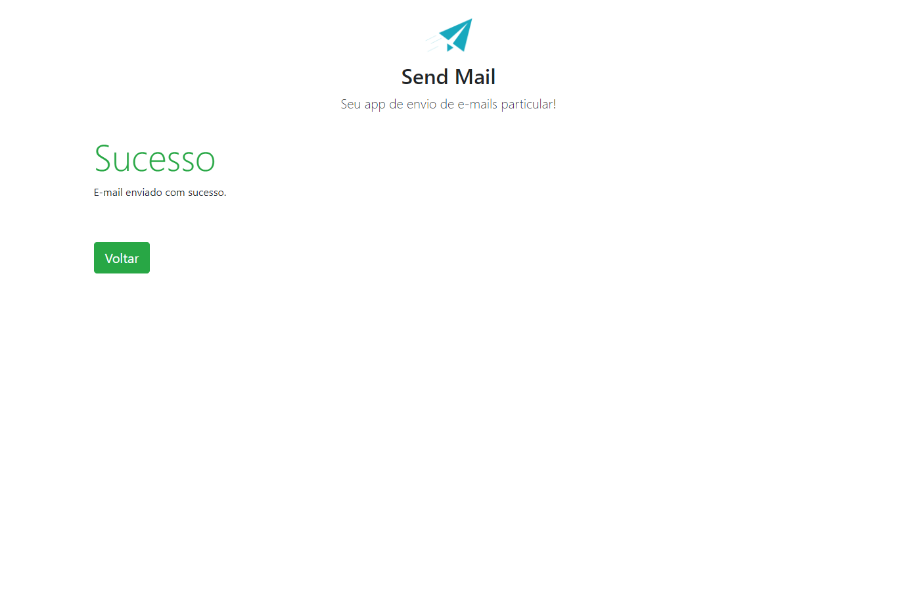

<h1 align="center"> App Send Mail </h1>

Atividade desenvolvida durante as aulas, aprimorando os conceitos da Linguagem PHP. 
 

  <a href="#-tecnologias">Tecnologias</a>&nbsp;&nbsp;&nbsp;|&nbsp;&nbsp;&nbsp;
  <a href="#-projeto">Projeto</a>&nbsp;&nbsp;&nbsp;|&nbsp;&nbsp;&nbsp;
  <a href="#memo-licença">Licença</a>

 

  

## 🚀 Tecnologias

Esse projeto foi desenvolvido com as seguintes tecnologias:

- HTML e CSS
- PHP
- Git e Github

## 💻 Projeto

O projeto App Send mail, consiste em uma aplicação que simula o envio de email para determinados usuários, atividade para reforçarmos os estudos do PHP utilizando o conceito de Orientação a Obejtos, implemtando alguns conceitos de segurança e práticas do dia á dia.

  

## :memo: Licença
